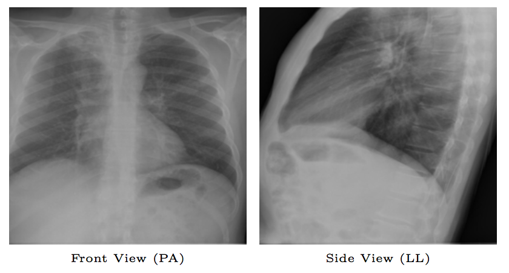

## chestViewSplit
This repo provides a trained model to seperate the chest x-ray into two views: front view (PA or posterior-anterior)  and side view (LL or latero-lateral). 


Sometimes when you download the chest x-rays from the internet, there's no  text description or meta data associated with the image. If you want to only work with images from a single view, you'll have to manually seperate the images which is tedious. Here I trained a model based on resnet-50 to automate the process and hopefully it can help people facing the same issue.

### Prerequistites
- Linux or OSX
- NVIDIA GPU
- Python 2.7
- PyTorch v0.2.0
- Numpy

### Getting Started
### Installation
- Install [PyTorh](https://github.com/pytorch/pytorch) and the other dependencies
- Clone this repo:
```bash
git clone https://github.com/xinario/chestViewSplit.git
cd chestViewSplit
```
- Download the trained model from [this link](https://drive.google.com/file/d/1vXhPWE-J4_eFY-UQ7A8pf3XdWhHO_lz_/view?usp=sharing) and put it into folder ./models (mkdir ./models)

### Classification
- Make sure all your chest x-rays resides in the same folder, e.g. ./chest_xray and then run the following command (-i specifies the input folder and -o specifies the output folder).
```bash
python xray_split.py -i chest_xray/ -o chest_xray/
```
- After running the above script, the images from two views will be saved in folder ./chest_xray/front and ./chest_xray/side respectively.

### Acknowlegements
Part of the code are borrowed from [fine-tuning.pytorch](https://github.com/meliketoy/fine-tuning.pytorch)
